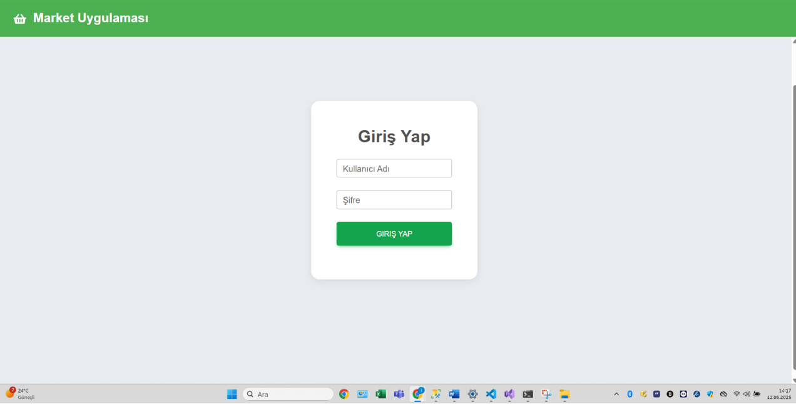
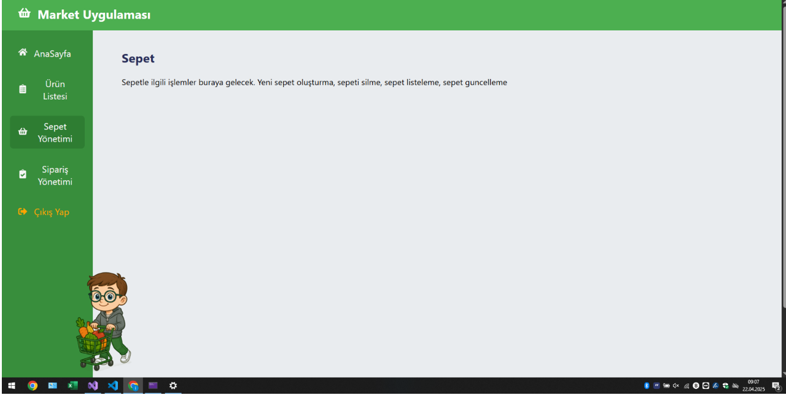
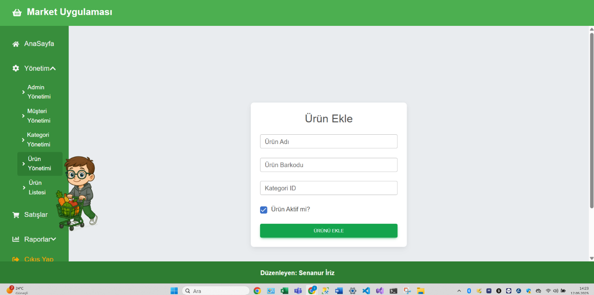
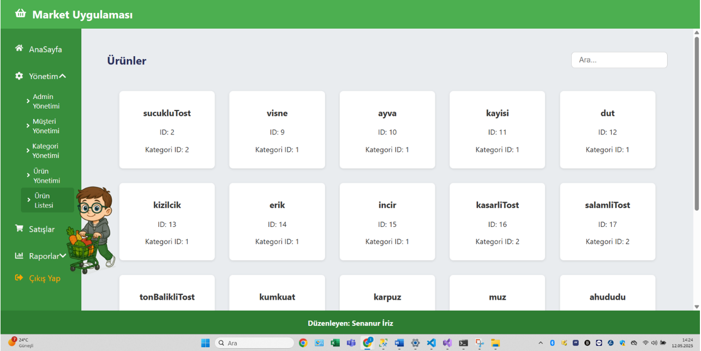
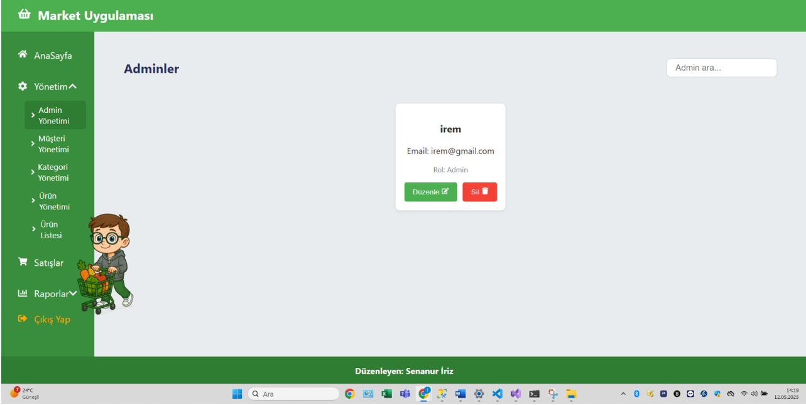
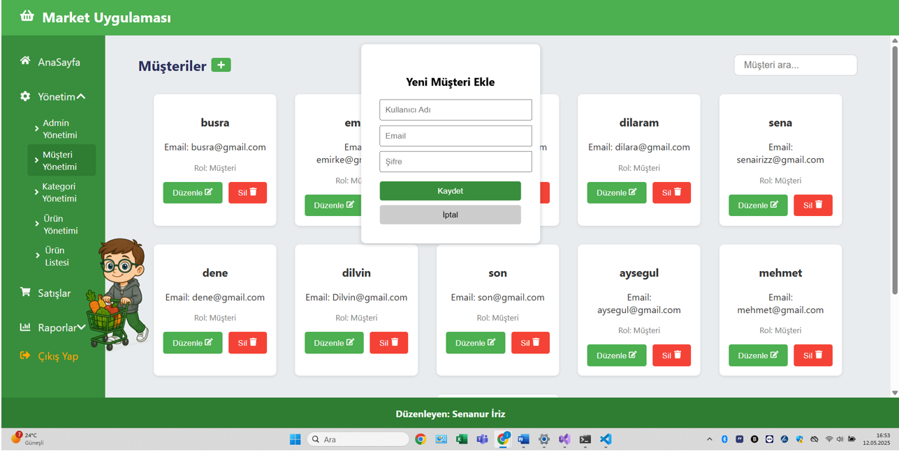
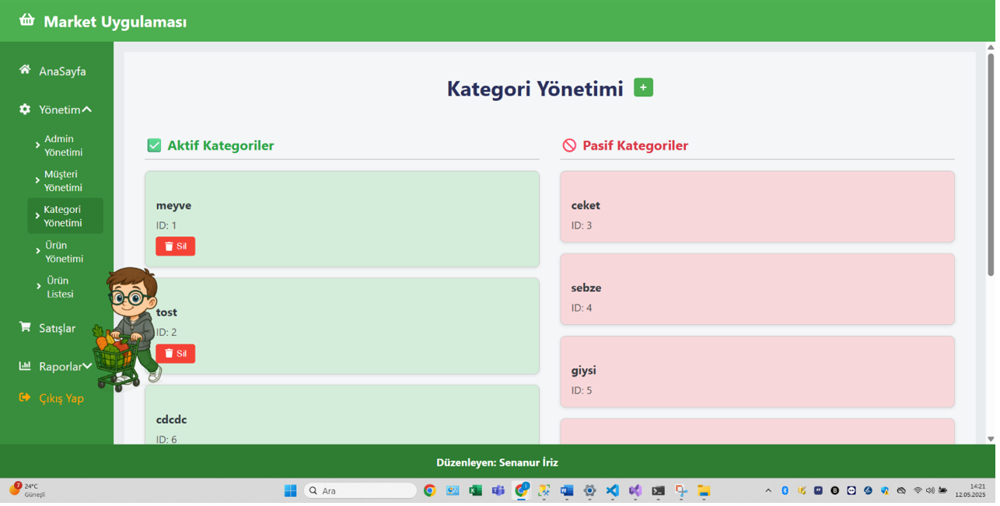

# 🛒 MarketAppWithReact

React + ASP.NET Core kullanarak Nesneye Yönelik Programlama prensipleriyle geliştirmekte olduğum fullstack bir e-ticaret uygulamasıdır.

## 🚀 Özellikler

- JWT ile kullanıcı girişi ve rol bazlı yetkilendirme (Admin & Müşteri)
- 🔐 Giriş sonrası kullanıcı rolüne göre ayrı panellere yönlendirme:
  - **Müşteri Paneli**: Ürünleri listeleme, arama, sepete ekleme ve sipariş oluşturma
  - **Admin Paneli**: Ürün, kategori, müşteri ve admin yönetimi (CRUD işlemleri)
- 📦 Ürün listeleme ve kategori bazlı filtreleme
- 🛒 Sepet yönetimi ve sipariş takibi
- 💳 Simülasyon tabanlı ödeme sistemi
- 📊 Yönetim panelinden kullanıcı, sipariş ve kategori kontrolü

  
## 🖼️ Ekran Görüntüleri

### 🔐 Giriş Sayfası  


### 🛒 Müşteri Paneli ve Sepet Yönetimi  


### 📦 Ürün Yönetimi  


### 📋 Ürün Listesi  


### 🛠️ Admin Yönetimi  


### 👤 Müşteri Yönetimi  


### 🗂️ Kategori Yönetimi  



## ⚙️ Teknolojiler

- React (frontend)
- ASP.NET Core + EF Core + MySQL (backend)
- Code First yaklaşımı

## 🛠️ Kurulum

```bash
# Backend
cd KullaniciYonetimi
dotnet restore
dotnet ef database update
dotnet run

# Frontend
cd frontend
npm install
npm start
